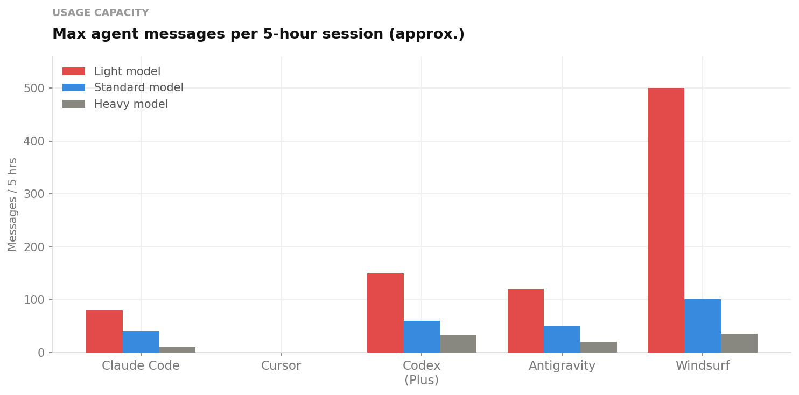
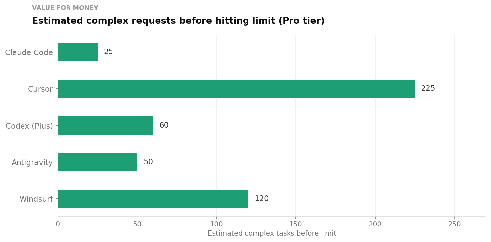
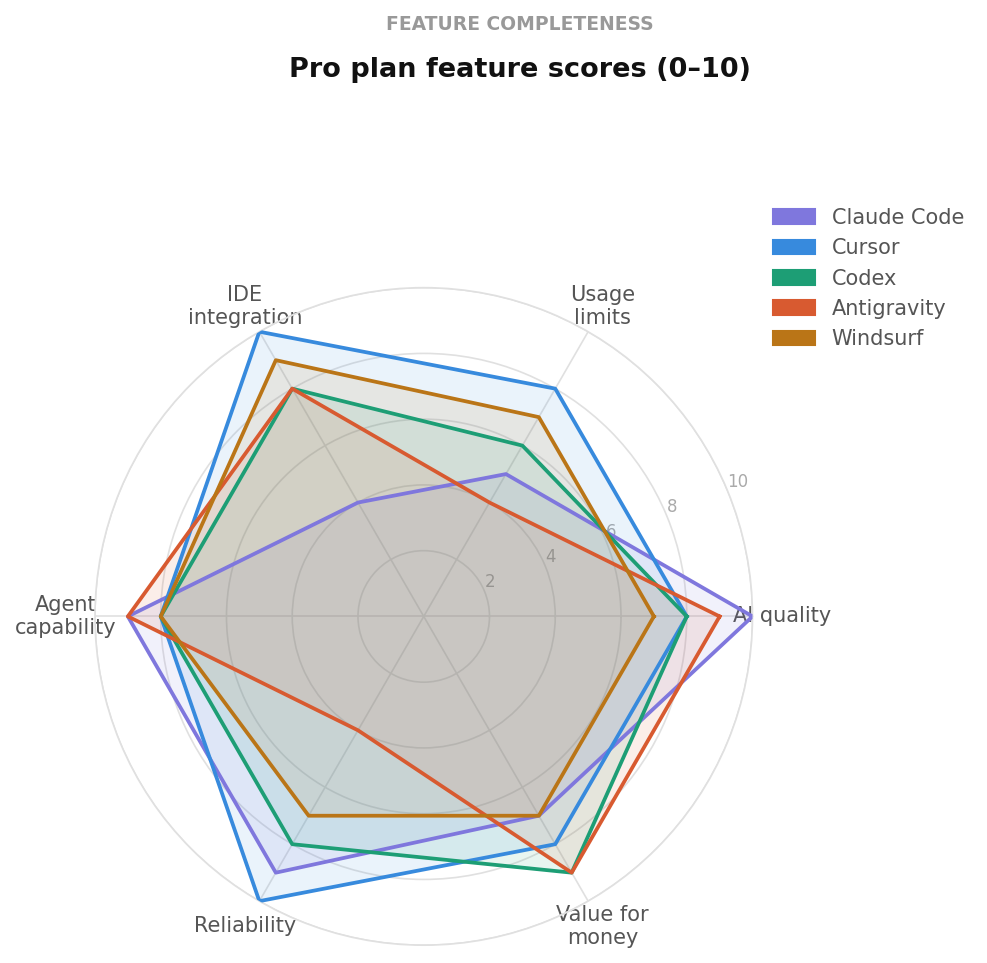
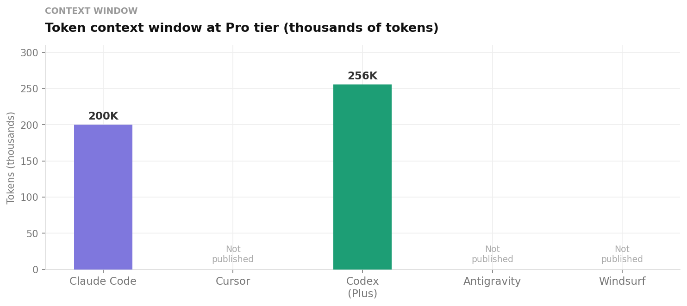

# Comparison Tables

> All data as of March 2026 · Pro tier (~$20/month)

---

## Pricing at a Glance

| Tool | Pro Price | Next Tier | Top Tier |
|------|-----------|-----------|----------|
| Claude Code | $20/mo | Max 5× — $100/mo | Max 20× — $200/mo |
| Cursor | $20/mo | Pro+ — $60/mo | Ultra — $200/mo |
| Codex (ChatGPT+) | $20/mo | Pro — $200/mo | Business — $30/user |
| Antigravity | $0* (preview) | Google AI Pro — $20/mo | Ultra — $249.99/mo |
| Windsurf | $20/mo | Max — $200/mo | Enterprise — custom |

---

## Usage Limits

| Tool | Limit Model | Session Cap | Monthly Cap | Resets |
|------|------------|-------------|-------------|--------|
| Claude Code | Rolling window + weekly | 5-hr window | ~40–80 Sonnet hrs/week | Rolling |
| Cursor | Credit pool | None (credit-based) | $20 credits | Monthly |
| Codex | Rolling window | 5-hr window | No published monthly cap | Rolling |
| Antigravity | Quota-based | 5-hr refresh | Unpublished | Per cycle |
| Windsurf | Monthly credits | None (credit-based) | ~500 credits | Monthly |

---

## Tab Completions

| Tool | Unlimited? | Credit Cost |
|------|-----------|-------------|
| Claude Code | ✅ Yes | None |
| Cursor | ✅ Yes | None |
| Codex | ✅ Yes | None |
| Antigravity | ✅ Yes | None |
| Windsurf | ✅ Yes | None |

> All five tools offer unlimited tab completions at every plan level. Limits only apply to agent tasks and explicit AI requests.

---

## Estimated Complex Tasks Per Month (Pro)

These are estimates based on published limits, community reports, and model pricing. "Complex task" = multi-file edit or agentic action using the default standard model.

| Tool | Estimated complex tasks | Notes |
|------|------------------------|-------|
| Cursor | ~225 | Premium model requests; Auto mode is unlimited |
| Windsurf | ~120–250 | Depends on model choice; SWE-1 is 1 cr/task |
| Codex | ~60–168 per 5-hr window | Resets every 5 hours; ~800/day with Mini model |
| Antigravity | ~50 | Quota instability makes this variable |
| Claude Code | ~25 (Opus) / ~80+ (Sonnet) per week | Weekly cap, not monthly |

---

## Context Window

| Tool | Context Window | Notes |
|------|---------------|-------|
| Codex | 256K tokens | Largest published |
| Claude Code | 200K tokens | Automatic compression on long conversations |
| Cursor | Not published | Intelligent chunking across full codebase |
| Antigravity | Not published | Varies by model |
| Windsurf | Not published | Standard; 1M token variant costs 2.5–4× credits |

---

## Model Access at Pro

| Tool | Standard Model | Best Model Available | Notes |
|------|---------------|---------------------|-------|
| Claude Code | Sonnet 4.6 | Opus 4.6 (3–5× quota cost) | Anthropic models only |
| Cursor | Auto (best fit) | Claude Sonnet 4.6, GPT-4o, Gemini | Multi-provider |
| Codex | GPT-5.3-Codex | GPT-5.4 | OpenAI models only |
| Antigravity | Gemini 3.1 Pro | Claude Opus 4.6 (free!) | Multi-provider |
| Windsurf | SWE-1 | Claude Sonnet 4.6 (2 cr/prompt) | Multi-provider + native |

---

## IDE Integration

| Tool | Interface Type | VS Code Fork | Extension Available |
|------|---------------|-------------|--------------------| 
| Claude Code | Terminal CLI | ❌ | ✅ VS Code extension |
| Cursor | Full IDE | ✅ | Native |
| Codex | Web + CLI | ❌ | ✅ VS Code, Cursor, Windsurf |
| Antigravity | Full IDE | ✅ | Native |
| Windsurf | Full IDE | ✅ | Native |

---

## Agentic Capabilities

| Tool | Multi-agent | Browser Agent | Async Cloud Tasks | Terminal Access |
|------|------------|--------------|------------------|----------------|
| Claude Code | ✅ Agent Teams | ❌ | ❌ | ✅ (CLI native) |
| Cursor | ✅ Cloud Agents | ❌ | ✅ | ✅ |
| Codex | ✅ Parallel agents | ❌ | ✅ | ✅ (sandboxed) |
| Antigravity | ✅ Agent Manager | ✅ (Chrome) | ✅ | ✅ (unrestricted*) |
| Windsurf | ✅ Cascade | ❌ | ✅ | ✅ |

*Antigravity agents have unrestricted terminal access by default on Windows/Linux. macOS sandbox added Feb 2026.

---

## Overage Options

| Tool | Overage Type | Cost |
|------|-------------|------|
| Claude Code | Buy credits or upgrade to Max | On-demand |
| Cursor | Pay-as-you-go at API rates | API cost (no markup) |
| Codex | Purchase credits | On-demand |
| Antigravity | Buy AI credits | $25 / 2,500 credits |
| Windsurf | Buy add-on credits | $10/250 cr or $40/1,000 cr |

---

## Security & Privacy

| Tool | Data Training | Execution Model | Notable |
|------|--------------|----------------|---------|
| Claude Code | Not used for training (paid) | Cloud (Anthropic) | Strong privacy controls |
| Cursor | Privacy mode available | Cloud (model providers) | SOC 2 |
| Codex | Not used on Business/Enterprise | Isolated cloud sandbox | Network disabled during execution |
| Antigravity | Not published | Live terminal/filesystem | Multiple CVEs documented; macOS sandbox only |
| Windsurf | Not used for training (paid) | Cloud | Standard controls |

---

## Feature Scores (0–10)

Subjective scores based on published capabilities, community feedback, and real-world testing.

| Feature | Claude Code | Cursor | Codex | Antigravity | Windsurf |
|---------|------------|--------|-------|-------------|---------|
| AI quality | 10 | 8 | 8 | 9 | 7 |
| Usage limits | 5 | 8 | 6 | 4 | 7 |
| IDE integration | 4 | 10 | 8 | 8 | 9 |
| Agent capability | 9 | 8 | 8 | 9 | 8 |
| Reliability | 9 | 10 | 8 | 4 | 7 |
| Value for money | 7 | 8 | 9 | 9 | 7 |

## Charts

### Agent messages per 5-hour session

### Estimated complex requests before hitting limit

### Feature radar

### Context window at Pro tier

---

*Last updated: March 2026*
